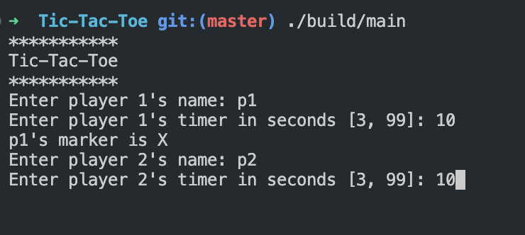
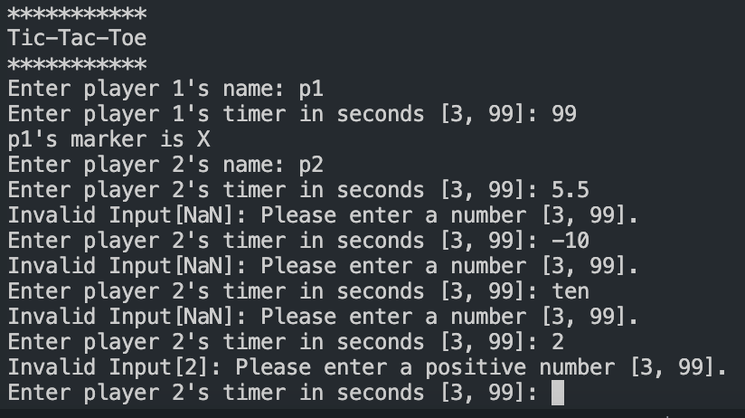
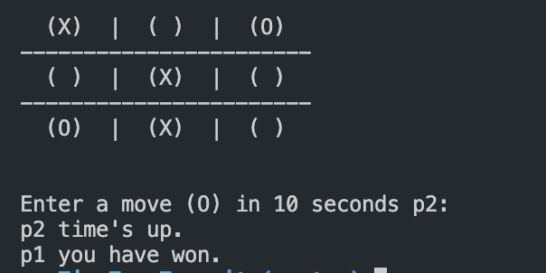
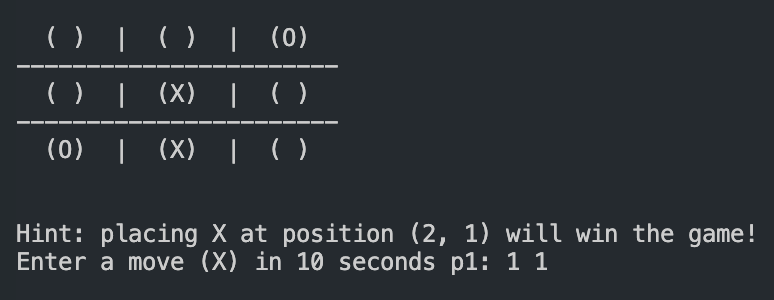
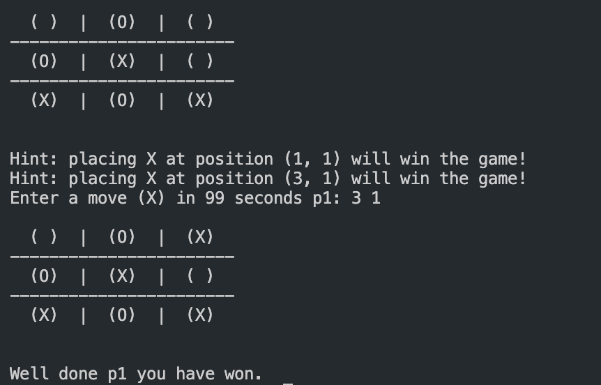
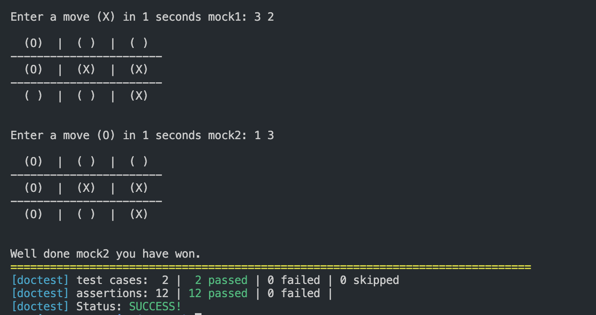

# Tic-Tac-Toe Investigation Report

## Quick Start

1. Compile code base, Move under the "src" folder (`{$project_root}/src/Tic-Tac-Toe`):
   ```
   make               # build all targets, inlcude `main` and `test`

   make build/main    # Only build main Tic-Tac-Toe program

   make build/test    # Only build unit test program

   make clean         # Clean up all the built files
   ```
2. Run the game: `./build/main`
3. Run all test cases: `./build/test`
   
   Only run test case 1: `./build/test -tc="check is_winner() function"`
   
   Only run test case 1: `./build/test -tc="check if the tokens layout is legit"`

> This project use some of C++17 features, add `-std=c++17` flag for custom build.

## Bug Fix
### Issue #1

**Description:** The tokens are not being placed on the correct tiles on the board according to the input coordinates. As a result, some valid moves cannot be executed. The error is caused by incorrect coordinate transformation to 2D array indices.

**How to Fix:** Modify the macro define of transformation constant. The commit [e2134e5](https://github.com/dchen23/Tic-Tac-Toe/commit/e2134e5e92e985e0359bb814bc24d97b6409a48e) solved it.

### Issue #1

**Description:** If three pieces are connected in the second or third row/column, it cannot be determined as a victory.

**How to Fix:** Correct the iteration to judge victory, make sure all row/column are checked. Solved in [e2134e5](https://github.com/dchen23/Tic-Tac-Toe/commit/e2134e5e92e985e0359bb814bc24d97b6409a48e).

## Feature Updates
### Feature #1 Hint

**Description:** Analyze the board to determine the next move that will result in a win. Once the opponent has made a move, print a message indicating the winning move.

**Implementation:** Before the system’s winning judgment ahead of each player’s move, Analyze the board and print a hint if possible. The feature is added in [61d917b](https://github.com/dchen23/Tic-Tac-Toe/commit/61d917b6423e8fd40e744ad99f80d9aeed65df28). (Multiple hints will be given if there are more than one winning move.)

### Feature #2 Timer

**Description:** To speed up the game and prevent players from stalling, each player is given a specific amount of time to make each move. If a player does not make a valid move within the allotted time, they will automatically lose the game.

**Implementation:** Create thread for timer operation. If the user type in before the time is up, a condition variable will notify the timer thread to stop, otherwise, timer thread will announce that your opponent winner the game and exit. Added in [a9c4aec](https://github.com/dchen23/Tic-Tac-Toe/commit/a9c4aec1d6a3e794215788eda37af990796a7c4b).

## Unit Test

### Unit Test Solution
Utilized a test framwork called [doctest](https://github.com/doctest/doctest), which is a header-only library that can be easily integrated into projects. It is also a powerful tool that can be used to test C++ code.
### Test Case #1

**Description:** Given several legit board layout for Tic-Tac-Toe. Check if the winning judgement system works as expectation.

**HImplementation:** This a static pattern test case. Details in [c23d33f](https://github.com/dchen23/Tic-Tac-Toe/commit/c23d33f258c25c5b4be54b5708608a2233e84b85).

### Test Case #2

**Description:** After each move is made, make sure the board layout is legal.

**Implementation:** This is a living test case. tester need to mock a full gameplay, the system will dynamic checking, later given a test report or interrupted if an assert found. Details in [c23d33f](https://github.com/dchen23/Tic-Tac-Toe/commit/c23d33f258c25c5b4be54b5708608a2233e84b85).

### Other Test Cases (in future)
 - Check if a token can be placed on each tiles
 - Print the board and compare with its internal layout
 - Make sure submit_move() works well, can filer out illegal move and keep right move
 - Test on the timer fucntion. (this will be a hard test case).

## Screenshots
- Player information set up:
  
  
  
- Input with wrong format for timer will print notice:

  

- If the player don't make a move before the timer is up, the opponent will win instantly:

  
   
- Print hint when the player is approaching winning for a single move:

  
  
- Print multiple hints if the player has different ways to win. In this case, Player 1 follow the second hint and win the game:

  

- Run two test cases:

  

## TODO
### Functional
- [ ] In some particular situations, a tie can be declared before the board is fully placed with tokens. For example, if the board is in a state where no player can win.
- [ ] Allow two players to play multiple games in one session and add a scoreboard to rank their scores, such as "tie -> 1 pt", "win -> 3 pts", "lose -> 0 pt"
- [ ] Build AI Bots for single playing
- [ ] Display the remaining time in a countdown format when the timer is close to expiring
- [ ] Enhance the online game matching feature.

### Non-functional
- [ ] Refactoring the codebase to reduce duplicated code and make it more modular
- [ ] Optimize the winning judgement and hint functions, which can be pre-computed at `submit_move()` stage.
